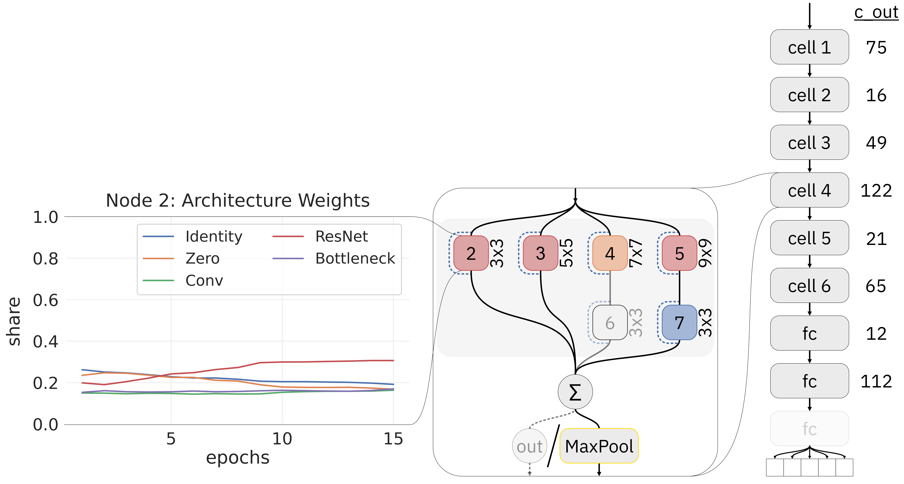

<!-- PROJECT LOGO -->
<br />
<div align="center">
    
    <h1 align="center">DARTS with skip prevention and flexible cell stacking</h1>
</div>


<!-- ABOUT THE PROJECT -->
## About The Project

<div align="center">
    <h4 align="center">Visualization of the network including an example cell and an example node</h4>
    
</div>

##
We propose a DARTS [[1](#bibliography)] extension. The key components are skip prevention with surrogate skip connections inspired by DARTS- [[2](#bibliography)] and early stopping inspired by ZeroLess-DARTS [[3](#bibliography)], flexible cell stacking by sampling from architecture weights, post-NAS BOHB [[7](#bibliography)] optimization and a new cell search space with the node structure seen in the image above that uses the following operations (with batch normalization and ReLU activation after convolutional layers):
- Identity
- Zero
- Convolution block
- ResNet block [[4](#bibliography)]
- ResNet bottleneck block [[4](#bibliography)]

We optimize the model with BOHB that uses the validation accuracy as the optimization target. For model training we use the focal loss [[5](#bibliography)] and class weighting to account for imbalanced class distribution of the [retinamnist](#data) dataset.

### Built With
<table align="center">
<td>
    <a href="https://pytorch.com">
    
    </a>
</td>
<td>
    <a href="https://github.com/automl/NASLib">
    
    </a>
</td>
<td>
    <a href="https://github.com/automl/SMAC3">
    
    </a>
</td>
</table>


<!-- GETTING STARTED -->
## Getting Started
### Installation
Download the project:

```shell
 git clone git@github.com:automl-classroom/automl-ss24-final-project-theautomatedslothmachine.git
 cd automl-ss24-final-project-theautomatedslothmachine
 ```

#### Conda
Create a conda environment:

```bash
conda create -n tropical_rainforest python=3.9
conda activate tropical_rainforest
git submodule update --init
# The Pip upgrade is needed due to a dependency installation bug fixed in the release
pip install --upgrade pip==24.2
pip install -r requirements.txt
```

If that fails you might have to run the following commands afterwards:

```bash
pip uninstall numpy
pip uninstall numpy
pip install numpy==1.26.4
conda install lightgbm
pip install -r requirements.txt
```

In one of our systems, conda installed two numpy versions for some reason and used the one which was not specified in the requirements.txt. It also wanted to use the lightgbm from conda and not from pip. We were not able to find the root causes, but this is probably a bug in conda.

#### Venv
or a python venv:

```bash
# Make sure you have python 3.9
python -V
python -m venv tropical_rainforest
./tropical_rainforest/bin/activate
git submodule update --init
# The Pip upgrade is needed due to a dependency installation bug fixed in the release
pip install --upgrade pip==24.2
pip install -r requirements.txt
```

#### Submodule

We have forked NASLib due to extensions and bugfixes. NASLib is added as a submodule and imported in the `requirements.txt`. Additionally, we have fixed bugs in a ConfigSpace fork which is included in the `requirements.txt`. 

### Data
We use the `retinamnist` dataset from [MedMNIST](https://medmnist.com/) dataset.

The dataset will be downloaded automatically by default to the `./data` directory.


<!-- USAGE EXAMPLES -->
## Usage

You can run experiments by adding your own configuration to `configs/` (e.g. `your_config.yaml`) and running the following command (see more options for bohb by running `python main.py -h`):

```shell
python main.py --config_file configs/your_config.yaml
```

If you want to reproduce our results run (due to compute time differences the results might differ):

```shell
./run.sh 
```

To plot and visualize the results run:

```shell
python -m plotting.bohb_progress results/acc_config/2 results/acc_config/3 results/acc_config/4 results/acc_config/5 results/acc_config/6
python -m plotting.score --dirpaths results/acc_config/2 results/acc_config/3 results/acc_config/4 results/acc_config/5 results/acc_config/6 --logpaths log2.txt log3.txt log4.txt log5.txt log6.txt
python -m plotting.arch_weights results/acc_config/2 results/acc_config/3 results/acc_config/4 results/acc_config/5 results/acc_config/6
```


## Evaluation Setup

Due to time constraints:

- our approach was run using 5 seeds for 2 hours each on an AMD Ryzen 5 5600 6-core CPU (NixOS 24.05).
- the baseline was run using 3 seeds for 6 hours each on an i7-11800h 8-core (NixOS 24.11.20240622)

We would've liked to run both for the same time on the same processor, but we found a critical bug on the last day which forced us to rerun our approach. The AMD Ryzen should be more powerful, but the shorter time still leads to a disadvantage.

## Related Work
Most approaches like Auto-Net [[9](#bibliography)] integrate architecture choices directly into the hyperparameter search space.
This is extended by Auto-PyTorch [[6](#bibliography)] and Zela et al. [[8](#bibliography)], which use the efficient sampling of BOHB [[7](#bibliography)] for selecting both architectures and hyperparameters.
These approaches take interactions between architecture selection and hyperparameters into account at the cost of losing the one-shot efficiency of DARTS [[1](#bibliography)].  
[[10](#bibliography)] uses evolutionary algorithms to find a network and then use BOHB afterwards for HPO.  
[[11](#bibliography)] does use DARTS in front of BOHB, like we want to do. They build normal and reduction cells using DARTS and build a more complex architecture by hand using the found cells. Afterwards they use BOHB to find a good learning rate and weight decay.  

We try to include DARTS' efficiency of finding architectures with BOHBs HPO search to get the best out of both worlds (see above).


## Bibliography

[1]: Liu, H., Simonyan, K. and Yang, Y. (2019) ‘DARTS: Differentiable Architecture Search’, arXiv [cs.LG]. Available at: http://arxiv.org/abs/1806.09055.

[2]: Chu, X. et al. (2021) ‘DARTS-: Robustly Stepping out of Performance Collapse Without Indicators’, arXiv [cs.LG]. Available at: http://arxiv.org/abs/2009.01027.

[3]: Fayyazifar, N. et al. (2023) ‘ZeroLess-DARTS: Improved Differentiable Architecture Search with Refined Search Operation and Early Stopping’, in Proceedings of the 2023 15th International Conference on Machine Learning and Computing. New York, NY, USA: Association for Computing Machinery (ICMLC ’23), pp. 54–60. doi: [10.1145/3587716.3587725](https://doi.org/10.1145/3587716.3587725)

[4]: He, K. et al. (2015) ‘Deep Residual Learning for Image Recognition’, arXiv [cs.CV]. Available at: http://arxiv.org/abs/1512.03385.

[5]: Lin, T.-Y. et al. (2018) ‘Focal Loss for Dense Object Detection’, arXiv [cs.CV]. Available at: http://arxiv.org/abs/1708.02002.

[6]: Zimmer, L., Lindauer, M. and Hutter, F. (2021) ‘Auto-PyTorch Tabular: Multi-Fidelity MetaLearning for Efficient and Robust AutoDL’, arXiv [cs.LG]. Available at: http://arxiv.org/abs/2006.13799.

[7]: Falkner, S., Klein, A. and Hutter, F. (2018) ‘BOHB: Robust and Efficient Hyperparameter Optimization at Scale’, arXiv [cs.LG]. Available at: http://arxiv.org/abs/1807.01774.

[8]: Zela, A. et al. (2018) ‘Towards Automated Deep Learning: Efficient Joint Neural Architecture and Hyperparameter Search’, arXiv [cs.LG]. Available at: http://arxiv.org/abs/1807.06906.

[9]: Mendoza, H. et al. (2016) ‘Towards Automatically-Tuned Neural Networks’, in Hutter, F., Kotthoff, L., and Vanschoren, J. (eds) Proceedings of the Workshop on Automatic Machine Learning. New York, New York, USA: PMLR (Proceedings of Machine Learning Research), pp. 58–65. Available at: https://proceedings.mlr.press/v64/mendoza_towards_2016.html.

[10]: Awad, N., Mallik, N. and Hutter, F. (8 2021) ‘DEHB: Evolutionary Hyberband for Scalable, Robust and Efficient Hyperparameter Optimization’, in Zhou, Z.-H. (ed.) Proceedings of the Thirtieth International Joint Conference on Artificial Intelligence, IJCAI-21. International Joint Conferences on Artificial Intelligence Organization, pp. 2147–2153. doi: 10.24963/ijcai.2021/296.

[11]: Saikia, T. et al. (2019) ‘AutoDispNet: Improving Disparity Estimation with AutoML’, CoRR, abs/1905.07443. Available at: http://arxiv.org/abs/1905.07443.
